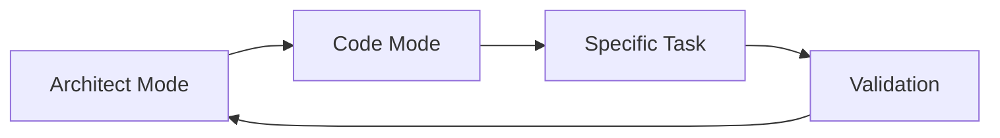

# Comprehensive Code Review and Enhancement Execution Plan

## Project Overview
**Application:** Astral Core React - Mental Health Support Platform  
**Technology Stack:** React 18, TypeScript, Vite, Service Workers, i18n  
**Deployment:** Netlify with PWA capabilities  
**Primary Goal:** Systematic enhancement with risk-minimized incremental improvements

## Phase 1: Project Analysis and Backup

### 1.1 Create Project Backup
**Priority:** Critical  
**Mode Required:** DevOps Specialist or Code mode  
**Token Cost:** Low

#### Implementation Steps:
```bash
# Create timestamped backup
tar -czf astral-backup-$(date +%Y%m%d-%H%M%S).tar.gz \
  --exclude=node_modules \
  --exclude=dist \
  --exclude=.git \
  --exclude=*.log \
  .

# Create backup manifest
echo '{
  "timestamp": "'$(date -u +%Y-%m-%dT%H:%M:%SZ)'",
  "files_count": '$(find . -type f | wc -l)',
  "project_version": "1.0.0",
  "node_version": "'$(node -v)'",
  "npm_version": "'$(npm -v)'"
}' > backup_manifest.json
```

#### Validation Criteria:
- Backup file exists and is > 1MB
- Manifest contains all required metadata
- Test extraction successful

### 1.2 Analyze Project Structure
**Priority:** High  
**Mode Required:** Architecture Analyst  
**Token Cost:** Low

#### Key Areas to Analyze:
1. **File Organization**
   - `/src/components/` - UI components
   - `/src/views/` - Page components
   - `/src/services/` - Business logic
   - `/src/utils/` - Utility functions
   - `/src/hooks/` - Custom React hooks
   - `/src/stores/` - State management

2. **Configuration Files**
   - `package.json` - Dependencies and scripts
   - `vite.config.ts` - Build configuration
   - `tsconfig.json` - TypeScript settings
   - `netlify.toml` - Deployment config

3. **Special Features**
   - Service Workers (sw-enhanced.ts, sw-custom.js)
   - Internationalization (/src/i18n/)
   - Testing (Jest, Playwright)
   - Performance optimization scripts

### 1.3 Understand Application Purpose
**Priority:** High  
**Mode Required:** Business Analyst  
**Token Cost:** Medium  
**Human Checkpoint:** Required

#### Core Functionality Assessment:
1. **Mental Health Support Features**
   - Crisis detection and resources
   - Peer-to-peer support system
   - Helper certification system
   - Safety planning tools
   - Community guidelines

2. **Technical Capabilities**
   - Offline functionality (Service Workers)
   - Multi-language support (7 languages)
   - Accessibility features
   - Real-time chat capabilities
   - AI-powered assistance

## Phase 2: UI/UX Review

### 2.1 Evaluate UI Aesthetics
**Priority:** Medium  
**Mode Required:** UI/UX Designer  
**Token Cost:** Medium

#### Review Checklist:
- [ ] Color scheme consistency (`/src/styles/design-system.css`)
- [ ] Typography hierarchy
- [ ] Component spacing and layout
- [ ] Animation and transitions
- [ ] Dark mode implementation
- [ ] Mobile responsiveness
- [ ] Visual accessibility (contrast ratios)

### 2.2 Assess User Experience
**Priority:** High  
**Mode Required:** UX Specialist  
**Token Cost:** Medium

#### Assessment Areas:
- Navigation patterns and user flows
- Loading states and error handling
- Form validation and feedback
- Accessibility compliance (WCAG 2.1)
- Mobile keyboard handling
- Touch target sizes

### 2.3 Identify UI Gaps
**Priority:** Medium  
**Mode Required:** UI/UX Designer  
**Token Cost:** Low  
**Human Checkpoint:** Required

## Phase 3: Code Quality Review

### 3.1 Code Standards Review
**Priority:** High  
**Mode Required:** Senior Developer  
**Token Cost:** Medium

#### Review Scope:
```javascript
// Check for:
- ESLint violations
- TypeScript strict mode compliance
- Naming conventions
- File organization
- Comment quality
- Dead code
```

### 3.2 Performance Analysis
**Priority:** High  
**Mode Required:** Performance Engineer  
**Token Cost:** Medium

#### Metrics to Analyze:
- Bundle size analysis (`npm run build:analyze`)
- Load time metrics
- Rendering performance
- Memory usage patterns
- Network request optimization
- Service Worker efficiency

### 3.3 Security Vulnerability Scan
**Priority:** Critical  
**Mode Required:** Security Specialist  
**Token Cost:** Low  
**Human Checkpoint:** Required

#### Security Checklist:
- [ ] Dependency vulnerabilities (`npm audit`)
- [ ] Authentication/authorization patterns
- [ ] Data encryption (crypto-js usage)
- [ ] XSS prevention
- [ ] CSRF protection
- [ ] Secure headers configuration

### 3.4 Test Coverage Assessment
**Priority:** Medium  
**Mode Required:** QA Engineer  
**Token Cost:** Low

#### Coverage Goals:
- Unit tests: 80% minimum
- Integration tests: Critical paths
- E2E tests: User journeys
- Service Worker tests: Offline scenarios

## Phase 4: Enhancement Planning

### 4.1 Prioritize Issues
**Priority:** High  
**Mode Required:** Project Manager  
**Token Cost:** Low  
**Human Checkpoint:** Required

#### Prioritization Matrix:
| Category | Critical | High | Medium | Low |
|----------|----------|------|--------|-----|
| Security | P0 | P1 | P2 | P3 |
| Bugs | P0 | P1 | P2 | P3 |
| Performance | P1 | P2 | P3 | P4 |
| UI/UX | P2 | P3 | P4 | P4 |

### 4.2 Create Enhancement Roadmap
**Priority:** High  
**Mode Required:** Technical Lead  
**Token Cost:** Medium  
**Human Checkpoint:** Required

## Phase 5: Critical Fixes Implementation

### 5.1 Fix Security Vulnerabilities
**Priority:** Critical  
**Mode Required:** Security Engineer  
**Token Cost:** Variable  
**Human Checkpoint:** Required

### 5.2 Fix Critical Bugs
**Priority:** Critical  
**Mode Required:** Senior Developer  
**Token Cost:** Variable

### 5.3 Implement Critical Missing Features
**Priority:** High  
**Mode Required:** Full Stack Developer  
**Token Cost:** High  
**Human Checkpoint:** Required

## Phase 6: UI Enhancement Implementation

### 6.1 Implement UI Consistency Fixes
**Priority:** Medium  
**Mode Required:** Frontend Developer  
**Token Cost:** Medium

### 6.2 Add Missing UI Elements
**Priority:** Medium  
**Mode Required:** UI Developer  
**Token Cost:** Medium  
**Human Checkpoint:** Required

### 6.3 Enhance User Experience
**Priority:** Medium  
**Mode Required:** UX Developer  
**Token Cost:** High

## Phase 7: Code Quality Improvements

### 7.1 Refactor Code Structure
**Priority:** Low  
**Mode Required:** Senior Developer  
**Token Cost:** High

### 7.2 Optimize Performance
**Priority:** Medium  
**Mode Required:** Performance Engineer  
**Token Cost:** High

### 7.3 Add Comprehensive Testing
**Priority:** Medium  
**Mode Required:** QA Engineer  
**Token Cost:** High

## Phase 8: Final Review and Documentation

### 8.1 Conduct Final Code Review
**Priority:** High  
**Mode Required:** Technical Lead  
**Token Cost:** Medium  
**Human Checkpoint:** Required

### 8.2 Update Documentation
**Priority:** High  
**Mode Required:** Technical Writer  
**Token Cost:** Medium

### 8.3 Create Deployment Package
**Priority:** Critical  
**Mode Required:** DevOps Engineer  
**Token Cost:** Low  
**Human Checkpoint:** Required

## Execution Strategy

### Token Optimization Protocol
1. Start with Phase 1.1-1.2 (lowest token cost)
2. Progress through security and critical fixes
3. Handle UI/UX improvements in batches
4. Complete with documentation and deployment

### Mode Switching Strategy


### Risk Mitigation
- Create restore points after each phase
- Validate changes in isolation
- Maintain rollback procedures
- Document all changes

## Next Steps

1. **Immediate Action:** Switch to Code mode to execute Phase 1.1 (Create backup)
2. **Sequential Execution:** Follow phase order strictly
3. **Checkpoint Validation:** Pause at human checkpoints for review
4. **Context Management:** Clear context between major phases

## Success Criteria

- [ ] All critical security vulnerabilities resolved
- [ ] Core functionality verified and enhanced
- [ ] UI/UX consistency achieved
- [ ] Test coverage ≥ 80%
- [ ] Documentation complete and accurate
- [ ] Deployment package validated

---

**Document Version:** 1.0.0  
**Created:** 2025-01-11  
**Status:** Ready for Execution