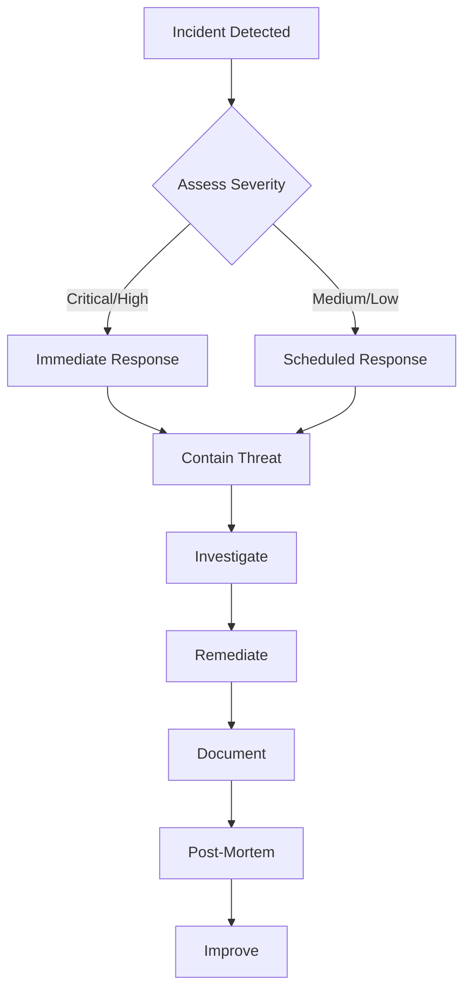

# Security Policy

## 🔒 Our Security Commitment

Astral Core handles sensitive mental health data and we take security extremely seriously. This document outlines our security policies, vulnerability reporting process, and security practices.

## Table of Contents
- [Supported Versions](#supported-versions)
- [Reporting a Vulnerability](#reporting-a-vulnerability)
- [Security Measures](#security-measures)
- [Compliance](#compliance)
- [Security Features](#security-features)
- [Development Security](#development-security)
- [Incident Response](#incident-response)
- [Security Contacts](#security-contacts)

## Supported Versions

We provide security updates for the following versions:

| Version | Supported          | End of Life |
| ------- | ------------------ | ----------- |
| 2.x.x   | ✅ Current        | Active      |
| 1.x.x   | ⚠️ Security only  | 2024-12-31  |
| < 1.0   | ❌ Not supported  | 2023-12-31  |

## Reporting a Vulnerability

### 🚨 Critical Vulnerabilities

For critical vulnerabilities that could immediately harm users:

1. **DO NOT** create a public issue
2. **Email immediately**: security@astralcore.app
3. **Include**:
   - Description of the vulnerability
   - Steps to reproduce
   - Potential impact
   - Suggested fix (if any)

### Response Timeline

- **Acknowledgment**: Within 24 hours
- **Initial Assessment**: Within 72 hours
- **Status Update**: Weekly or as needed
- **Resolution Target**:
  - Critical: 7 days
  - High: 14 days
  - Medium: 30 days
  - Low: 90 days

### Responsible Disclosure

We support responsible disclosure and will:
- Work with you to understand and resolve the issue
- Credit you in our security acknowledgments (unless you prefer anonymity)
- Not pursue legal action for good-faith security research

### What Qualifies as a Security Vulnerability?

#### ✅ In Scope
- Authentication/authorization bypasses
- Data exposure or leakage
- Cross-site scripting (XSS)
- SQL/NoSQL injection
- Cross-site request forgery (CSRF)
- Remote code execution
- Privilege escalation
- Session hijacking
- Cryptographic weaknesses
- Denial of service vulnerabilities
- Privacy violations

#### ❌ Out of Scope
- Social engineering attacks
- Physical attacks
- Attacks requiring physical access
- Attacks on third-party services
- Volumetric DDoS attacks
- Issues in dependencies (report to maintainer)
- Missing security headers in development

## Security Measures

### Architecture Security

```
┌─────────────────────────────────────────┐
│            User Browser                  │
│  - CSP, HTTPS, Secure Cookies           │
└────────────┬────────────────────────────┘
             │ TLS 1.3
┌────────────▼────────────────────────────┐
│           CDN/WAF Layer                  │
│  - DDoS Protection, Rate Limiting       │
└────────────┬────────────────────────────┘
             │
┌────────────▼────────────────────────────┐
│         Application Layer                │
│  - Auth0, RBAC, Input Validation        │
└────────────┬────────────────────────────┘
             │
┌────────────▼────────────────────────────┐
│          Database Layer                  │
│  - Encryption at Rest, Audit Logs       │
└─────────────────────────────────────────┘
```

### Data Protection

#### Encryption
- **At Rest**: AES-256-GCM
- **In Transit**: TLS 1.3 minimum
- **Key Management**: Automated rotation every 90 days
- **Secrets**: Stored in secure vault (never in code)

#### Data Classification
| Level | Description | Examples | Protection |
|-------|-------------|----------|------------|
| Critical | PII, Health Records | SSN, Diagnoses | Encrypted, Audit Logged |
| Sensitive | User Data | Email, Preferences | Encrypted |
| Internal | System Data | Logs, Metrics | Access Controlled |
| Public | Open Data | Resources, Articles | None Required |

### Authentication & Authorization

#### Multi-Factor Authentication
```javascript
// Required for:
- Admin accounts
- Helper accounts
- Access to sensitive data
- Configuration changes
```

#### Session Security
- Secure, httpOnly, sameSite cookies
- Session timeout: 30 minutes (production)
- Concurrent session limit: 3 devices
- Automatic token refresh

### Network Security

#### Firewall Rules
```
Inbound:
- 443/tcp (HTTPS) - Public
- 22/tcp (SSH) - Restricted to bastion
- All other ports - Denied

Outbound:
- 443/tcp (HTTPS) - Allowed
- 25/tcp (SMTP) - Email service only
- All other ports - Logged and restricted
```

#### Rate Limiting
```typescript
// Configuration per endpoint
const rateLimits = {
  global: '1000 requests per 15 minutes',
  authentication: '5 requests per 15 minutes',
  api: '100 requests per 15 minutes',
  crisis: '100 requests per minute', // Higher for emergencies
};
```

## Compliance

### HIPAA Compliance
- ✅ Administrative Safeguards
- ✅ Physical Safeguards
- ✅ Technical Safeguards
- ✅ 7-year data retention
- ✅ Audit logging
- ✅ Encryption requirements
- ✅ Access controls
- ✅ Business Associate Agreements (BAAs)

### GDPR Compliance
- ✅ Right to be forgotten
- ✅ Data portability
- ✅ Consent management
- ✅ Privacy by design
- ✅ Data minimization
- ✅ Breach notification (72 hours)

### SOC 2 Type II
- ✅ Security
- ✅ Availability
- ✅ Processing Integrity
- ✅ Confidentiality
- ✅ Privacy

## Security Features

### Crisis Mode Security
Special security considerations for crisis situations:
```typescript
// Crisis mode allows bypassing certain restrictions
// while maintaining security and audit trail
if (crisisMode) {
  // Bypass rate limiting
  // Maintain audit logging
  // Alert crisis team
  // Allow HTTP if HTTPS fails (with warning)
}
```

### Zero-Trust Implementation
```yaml
Principles:
  - Never trust, always verify
  - Least privilege access
  - Assume breach
  - Verify explicitly
  
Implementation:
  - Device fingerprinting
  - Continuous validation
  - Network segmentation
  - Microsegmentation
  - Encrypted everything
```

### Content Security Policy
```javascript
// Production CSP
Content-Security-Policy: 
  default-src 'self';
  script-src 'self' 'nonce-{random}';
  style-src 'self' 'unsafe-inline';
  img-src 'self' data: https:;
  connect-src 'self' https://api.astralcore.app;
  font-src 'self';
  object-src 'none';
  media-src 'self';
  frame-src 'none';
  base-uri 'self';
  form-action 'self';
  frame-ancestors 'none';
  upgrade-insecure-requests;
```

## Development Security

### Secure Development Lifecycle

#### 1. Design Phase
- Threat modeling
- Security requirements
- Privacy impact assessment

#### 2. Development Phase
- Secure coding standards
- Peer code reviews
- Static analysis (SAST)

#### 3. Testing Phase
- Dynamic testing (DAST)
- Penetration testing
- Security regression tests

#### 4. Deployment Phase
- Security configuration review
- Secrets management
- Infrastructure scanning

#### 5. Maintenance Phase
- Security monitoring
- Incident response
- Regular updates

### Security Testing

#### Automated Security Checks
```bash
# Run before each commit
npm run security:check

# Includes:
- Dependency vulnerability scan
- Code security analysis
- Secret detection
- OWASP compliance check
```

#### Manual Security Testing
```bash
# Quarterly penetration testing
# Annual security audit
# Continuous bug bounty program
```

### Dependency Management

#### Vulnerability Scanning
```bash
# Check dependencies
npm audit

# Auto-fix when possible
npm audit fix

# Check for outdated packages
npm outdated
```

#### Update Policy
- Critical vulnerabilities: Immediate
- High vulnerabilities: Within 7 days
- Medium vulnerabilities: Within 30 days
- Low vulnerabilities: Next release

## Incident Response

### Incident Classification

| Severity | Description | Response Time | Team |
|----------|-------------|--------------|------|
| Critical | Active exploitation, data breach | Immediate | All hands |
| High | Vulnerability with PoC, potential breach | 1 hour | Security + Dev |
| Medium | Vulnerability without PoC | 4 hours | Security |
| Low | Theoretical vulnerability | 24 hours | Security |

### Response Process



### Communication Plan

#### Internal Communication
1. Security team notification
2. Development team mobilization
3. Management briefing
4. Legal consultation (if needed)

#### External Communication
1. Affected users (within 72 hours)
2. Regulatory bodies (HIPAA, GDPR)
3. Public disclosure (after remediation)
4. Security advisory publication

## Security Audit

### Regular Audits

#### Daily
- [ ] Automated vulnerability scans
- [ ] Log analysis
- [ ] Failed authentication attempts
- [ ] Anomaly detection

#### Weekly
- [ ] Dependency updates
- [ ] Access review
- [ ] Security metric review
- [ ] Incident review

#### Monthly
- [ ] Penetration testing
- [ ] Configuration review
- [ ] Compliance check
- [ ] Security training

#### Annually
- [ ] Full security audit
- [ ] Compliance certification
- [ ] Disaster recovery test
- [ ] Security policy review

### Security Metrics

```typescript
// Key metrics we track
const securityMetrics = {
  meanTimeToDetect: '<1 hour',
  meanTimeToRespond: '<4 hours',
  meanTimeToResolve: '<24 hours',
  vulnerabilitiesFixed: '100% critical within 7 days',
  securityTraining: '100% of team quarterly',
  incidentRate: '<1 per quarter',
};
```

## Security Tools

### Development Tools
```bash
# Static Analysis
- ESLint security plugin
- SonarQube
- Semgrep

# Dependency Scanning
- npm audit
- Snyk
- WhiteSource

# Secret Detection
- GitGuardian
- TruffleHog
- detect-secrets

# Dynamic Analysis
- OWASP ZAP
- Burp Suite
- Nuclei
```

### Production Monitoring
```bash
# Security Monitoring
- Sentry (error tracking)
- Datadog (APM + SIEM)
- CloudFlare (WAF)

# Threat Detection
- Fail2ban
- OSSEC
- Wazuh

# Compliance
- AWS Config
- Cloud Custodian
- Open Policy Agent
```

## Security Contacts

### Primary Contacts

| Role | Contact | Response Time |
|------|---------|--------------|
| Security Team | security@astralcore.app | 24/7 |
| CISO | ciso@astralcore.app | Business hours |
| Legal | legal@astralcore.app | Business hours |
| DPO (GDPR) | privacy@astralcore.app | Business hours |

### Emergency Contacts

🚨 **24/7 Security Hotline**: +1-XXX-XXX-XXXX

### Bug Bounty Program

We run a bug bounty program through HackerOne:
- Minimum bounty: $100
- Maximum bounty: $10,000
- Average response: 24 hours
- Program URL: https://hackerone.com/astralcore

## Security Acknowledgments

We thank the following security researchers for their responsible disclosure:

- [Researcher Name] - XSS vulnerability (2024-01)
- [Researcher Name] - Authentication bypass (2024-02)
- [Anonymous] - SQL injection (2024-03)

## Additional Resources

- [OWASP Top 10](https://owasp.org/www-project-top-ten/)
- [HIPAA Security Rule](https://www.hhs.gov/hipaa/for-professionals/security/index.html)
- [GDPR Compliance](https://gdpr.eu/)
- [NIST Cybersecurity Framework](https://www.nist.gov/cyberframework)

## Security Commitment

> "Security is not a feature, it's a foundation. Every line of code, every design decision, and every deployment considers the security and privacy of our users' sensitive mental health data."

*Last Updated: 2024-01-20*
*Next Review: 2024-04-20*

---

**Remember**: If you see something, say something. Security is everyone's responsibility.